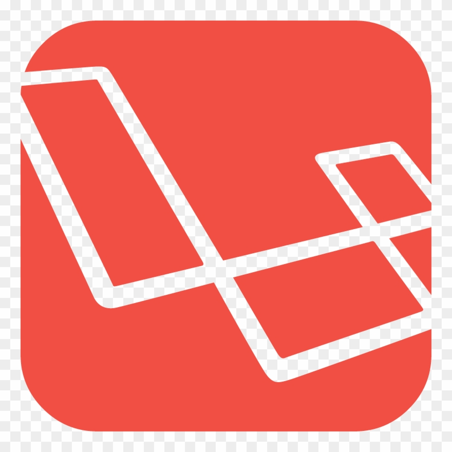
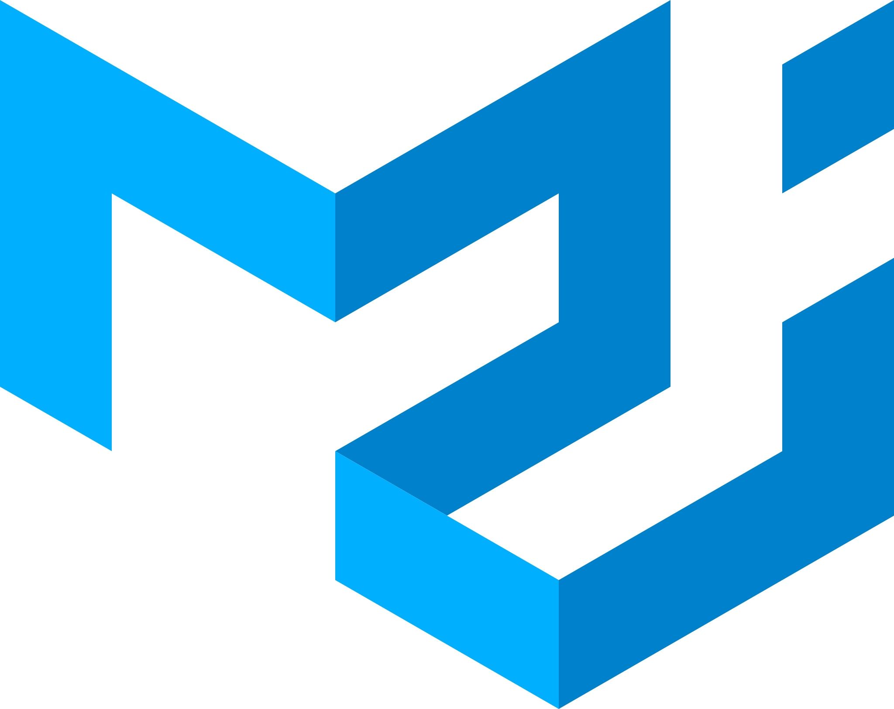

### Hi there, i'm [MinhPN](#) &nbsp; 

#### 🧑🏻‍💻 &nbsp; About me

- 💡 &nbsp; Explore new technologies and develop web software solutions
- 🎓 &nbsp; Fullstack Developer at Tinhvan Outsourcing JSC. (TVO)
- 💼 &nbsp; Learning and working with web and mobile technologies

#### 💻 &nbsp; Tech Stack

- Languages

  <code></code>
  <code></code>
  <code></code>
  <code></code>
  <code></code>
  <code></code>
  <code></code>

- Frameworks and libraries

  <code></code>
  <code></code>
  <code></code>
  <code></code>

  <code></code>
  <code></code>
  <code></code>
  <code></code>
  <code></code>
  <code></code>
  <code></code>
  <code></code>
  <code></code>

- Tools

  <code></code>
  <code></code>
  <code></code>
  <code></code>
  <code></code>

#### 📇 &nbsp; Reach me

<!--  -->

  
  

